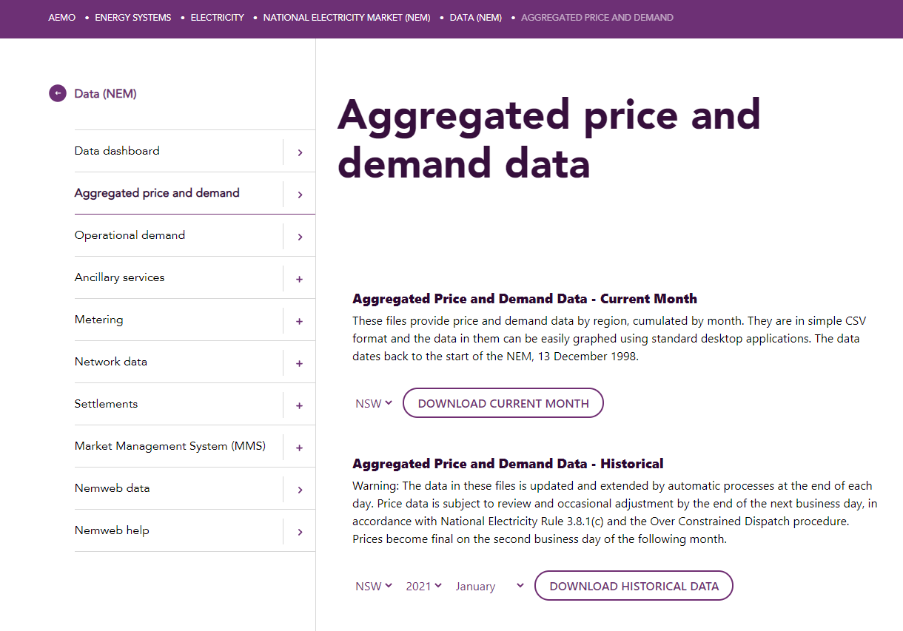
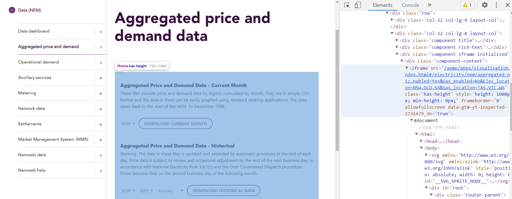
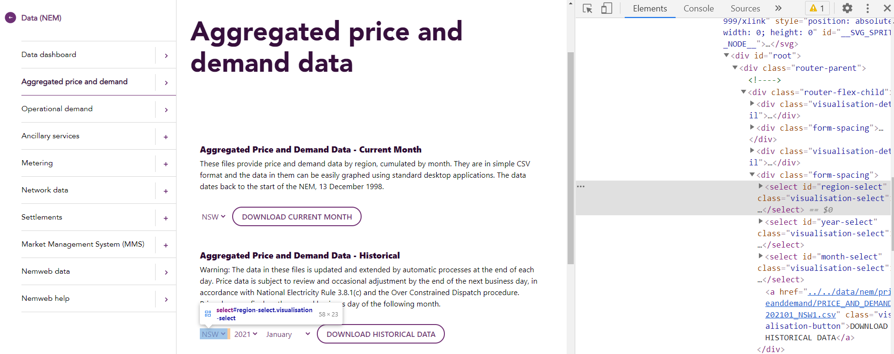
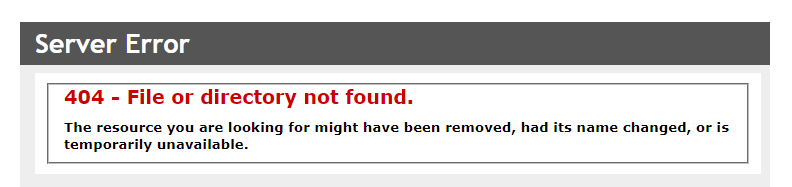

Scraping data using RSelenium/Docker
================

## Introduction

The Australian Energy Market Operator (AEMO) regulates the electricity
and gas markets in Australia. The National Electricity Market (NEM) is
the electricity market covering ACT, QLD, SA, VIC and TAS. Each month
AEMO releases aggregated price and demand data for the NEM. In this
article we will use `Docker` and `RSelenium` to automatically download the
price and demand data provided on the AEMO website.

### NEM Data

The data is available
[here](https://www.aemo.com.au/energy-systems/electricity/national-electricity-market-nem/data-nem/aggregated-data).
The website has structured the data into individual CSV files split by
region, month and year. In total there are 5 regions spanning 24 years,
meaning there are 1,000+ individual files to download. Without
automation, this would be a tedious task. Luckily for us, we can
automate the downloading using a combination of Docker and `RSelenium`.

------------------------------------------------------------------------

## Setting things up

### Installing `RSelenium`

Within RStudio, install
[RSelenium](https://cran.r-project.org/web/packages/RSelenium/index.html)
from CRAN. For transparency, I am running R 4.0.0 or later.

``` r
install.packages("RSelenium")
```

### Installing Docker

[Docker](https://www.docker.com/) is an open platform for developing,
shipping and running applications. For our purposes, we’ll use Docker to
create a container within which we’ll be able to drive a browser to do
the downloading on our behalf.

To start, download the free version of Docker Desktop. For further
transparency, I am running Windows 10. Beyond this there really isn’t
anything else to setup. To set up a Docker container, open Docker
Desktop (ensure you have signed in). Next, open up a the command line
(or a terminal in RStudio) and run:

``` r
docker run -d -p 4445:4444 -p 5901:5900 -v C:/Users/edppe/Downloads:/home/seluser/Downloads selenium/standalone-chrome-debug
```

Be sure to swap out the first directory for one on your machine. Here,
the first directory is the location on my local machine that I want the
files to be written to. The second directory is where the files will be
in the virtual container. The final argument is telling Docker to use
the relevant Chrome driver.

Once you’ve run this, you should be able to see a new container in the
Docker Desktop GUI with a randomly generated name (`epic_hypatia` in
this case).


------------------------------------------------------------------------

## Running `RSelenium`

We can now start to investigate the underlying structure of the webpage.

``` r
library(RSelenium)
```

``` r
x = RSelenium::remoteDriver(
  remoteServerAddr = "localhost",
  port = 4445L,
  browserName = "chrome")

x$open()
```

We now have an object `x` of class `remoteDriver`. This can be used to
drive the Chrome browser. To check the status of the server, run:

``` r
x$getStatus()
```

Now we can navigate to the AEMO webpage. As of 2022-02-11, it looks
something like this:



Next, we’ll navigate the driver to the webpage.

``` r
url = "https://www.aemo.com.au/energy-systems/electricity/national-electricity-market-nem/data-nem/aggregated-data"
x$navigate(url)
```

By using the developer tools in Chrome (`CTRL + SHIFT + I`), we can see
that the dropdown boxes and download button are wrapped inside an
`<iframe>` tag.



We will need to ensure we navigate inside this Inline Frame in the
webpage.

``` r
frames = x$findElements("css", "iframe")
x$switchToFrame(frames[[1]])
```

Now that the driver is inside the `<iframe>`, we can try to locate the
elements representing the dropdown lists and download button. Once
again, using the Chome developer tools, we can see that the dropdown
lists are `<select>` tags and have `id` attributes of `region-select`,
`year-select` and `month-select`.



Therefore, we can drive these dropdown lists using these `<select>`
tags. For example, to select the `VIC` element of the `region-select`
dropdown list, we would run:

``` r
element = x$findElement(using = 'xpath', "//select[@id='region-select']/option[@value = 'VIC1']")
element$clickElement()
```

Now that we have figured out how to navigate the elements of the
webpage, we can finish automating the process.

------------------------------------------------------------------------

## Exception handling

To make the automation more robust, it is recommended to add in some
basic exception handling. One option involves wrapping function calls
inside a `tryCatch()` function (see
[this](http://adv-r.had.co.nz/Exceptions-Debugging.html#condition-handling)
for further details). Instead, we will try to catch any errors from the
browser using `RSelenium`.

You’ll notice that for a specific combination of options from the three
`<select>` tags, that there is no underlying CSV file available to
download. For example, if you select `TAS`, `1998` and `January` from
each box, when the `DOWNLOAD HISTORICAL DATA` button is clicked, the
webpage throws a `404` error.



This isn’t an issue as long as we account for it in the scraping code.
Essentially, we will create a function to perform the page navigation
and the selection of the `<iframe>` tag. This is required because once a
`404` page is thrown, we will need to refresh the page and reselect the
frame.

``` r
renavigate_to_frame = function(url, x) {
  
  x$navigate(url)
  frames = x$findElements("css", "iframe")
  x$switchToFrame(frames[[1]])
  
  return(x)
}
```

To check for a `404` error, we will extract the log from the browser and
check for a `404` message.

``` r
element$log(type = "browser")
```

------------------------------------------------------------------------

## Automated downloading

To automate the full download of all the CSV files, we can loop through
the full list of regions, years and months whilst ensuring we add any
necessary error checks for instances where the underlying elements or
files might not exist. For example, we could download all the available
files using the following script:

``` r
url = "https://www.aemo.com.au/energy-systems/electricity/national-electricity-market-nem/data-nem/aggregated-data"

x = RSelenium::remoteDriver(
  remoteServerAddr = "localhost",
  port = 4445L,
  browserName = "chrome")

x$open()

x = renavigate_to_frame(url = url, x = x)

for (i in c("QLD", "SA", "VIC", "NSW", "TAS")) { # Loop through each region
  
  element = x$findElement(using = 'xpath', paste0("//select[@id='region-select']/option[@value = '", i, "1']")) # Find the 'region-select' <select> tag
  element$clickElement() # Click the option from the list
  
  for (j in as.character(1998:2020)) { # Loop through each year
    
    element = x$findElement(using = 'xpath', paste0("//select[@id='year-select']/option[@value = '", j, "']")) # Find the 'year-select' <select> tag
    element$clickElement() # Click the option from the list
    
    for (k in sprintf("%02d", 1:12)) { # Loop through each month

      element = x$findElement(using = 'xpath', paste0("//select[@id='month-select']/option[@value = '", k, "']")) # Find the 'month-select' <select> tag
      element$clickElement() # Click the option from the list
      
      cat(paste0('\n-> Attempting download for ', i, ' for ', j, '-', k))
      Sys.sleep(0.1)
      
      element = x$findElement(using = 'xpath', "//*[contains(text(), 'DOWNLOAD HISTORICAL DATA')]") # Find the download button
      element$clickElement() # Click the button
      
      brwsr_log = element$log(type = "browser") # Get the browser log from the element
      
      if (length(brwsr_log)) {
        
        if (!sum(sapply(brwsr_log, FUN = function(x) {grepl("404", x$message)}))) { # Check each list entry of the log for a '404' message
          
          cat(paste0(" -> Success!"))
          
        } else {
          
          cat(paste0(' -> Failed'))
          x = renavigate_to_frame(url = url, x = x) # If we have landed on a '404' page in the <iframe>, then refresh the page and reselect the <iframe>
          element = x$findElement(using = 'xpath', paste0("//select[@id='region-select']/option[@value = '", i, "1']")) # Find the 'region-select' <select> tag
          element$clickElement() # Click the option from the list again
          element = x$findElement(using = 'xpath', paste0("//select[@id='year-select']/option[@value = '", j, "']")) # Find the 'year-select' <select> tag
          element$clickElement() # Click the option from the list again
          
        }
        
      } else {
        
        cat(paste0(" -> Success!"))
        
      }

    }
  }
}

x$close()
```

…et voila! 1,000+ CSV files sitting in your directory ready for
analysis… 😄 😄 😄

<a href = "#top">Back to top</a>
